# FitURJC

### Description

* __If you want a online gym, this is the perfect page. You have some filters and inputs fields in order to find your perfect routine.__

  Both sign up as gym and user options availables. As user, you can see the gym page, send feedback and rate them. The restaurant user can   upload images.
  * The private part is the admin's.
  * The public part is the gym's and profile's.
* __Users__:
  * Gym user.
  * Admin user.
  * Default user.
* __Entities__:
  * Users.
  * Courses.
  * Facilities.
  * Schedules.
* __Advanced funcionability__:
  * One user can not be registered in two or more activities at the same time. 
  * Personalized Recommendations.
* __Technology__:
  * Can register using Facebook acount.
* __Graphics__:
  * Dashboard about affluence of users in each activity and courses by category.
* __Authors:__
  * **Carlos Olmo Sahuquillo** [@CarlUndert] (https://github.com/CarlUndert)  
  Contact: c.olmosa@alumnos.urjc.es
  * **Maria Victoria Marcos Gómez** [@VictoriaMG] (https://github.com/VictoriaMG)  
 Contact: mv.marcos@alumnos.urjc.es
  * **Daniel Peña Martinez**     [@dpemar] (https://github.com/dpemar)  
 Contact: d.penam@alumnos.urjc.es
  * **Iván Pérez Huete**      [@IvanPerez9] (https://github.com/IvanPerez9)   
 Contact: i.perezhu@alumnos.urjc.es

 * __Navigation Diagram:__
 

### Pages
 * __Index.html - Main page:__
    
    
    
    
      * Description: This is the first page you can see in our application. You have a login section and a sign in section too. If you only want to see some superficial information you have some sections to inspect our services along with our professionals.

* __Facilities.html:__
    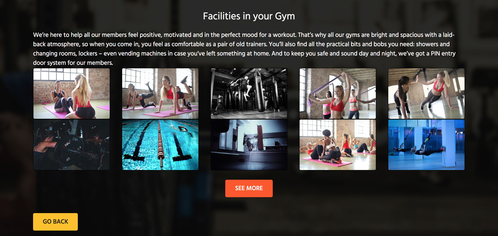
  * Description: This section offers images of the different locations that exist in the gym
  
* __Register.html:__
    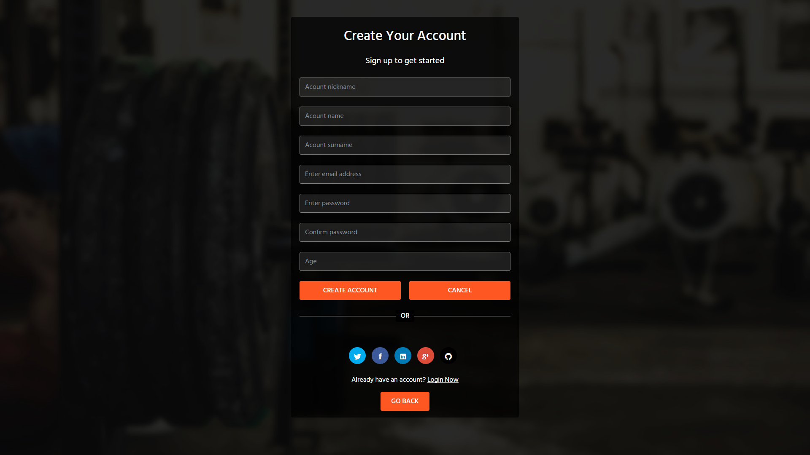
  * Description: Here is where you can register as a new member. It consist of a few typical fields, such as "user name" , "password" ...
       
* __Login.html:__
    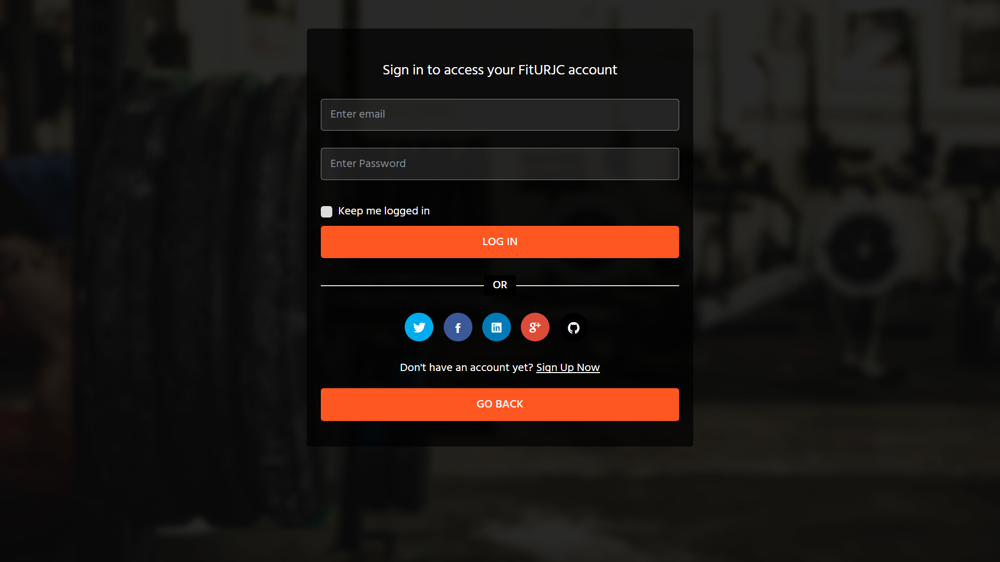
  * Description: Similar to the previous page, but in this case, you have to be identified yourself as a member.

* __User.html:__
    
    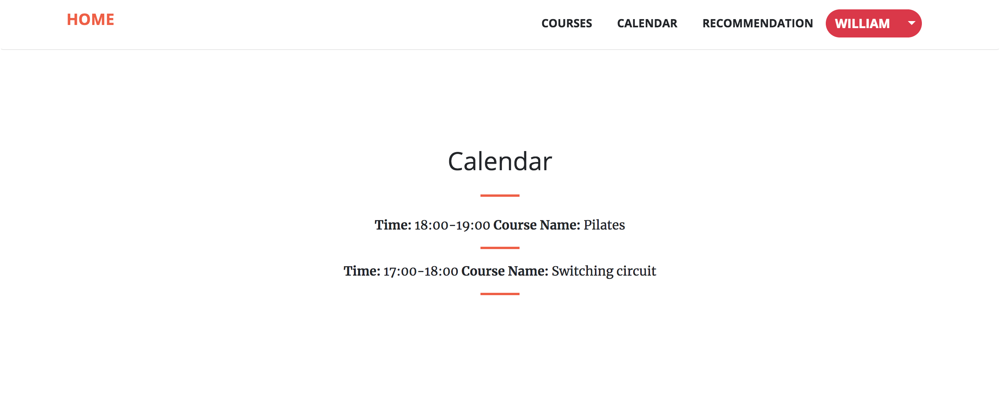
    
    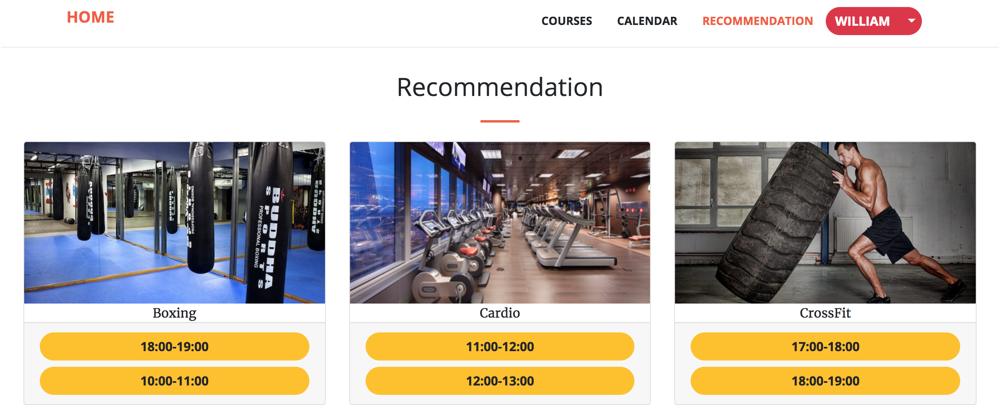
    * Description: This is the page you can see when you log in. It shows information about your activities, it also shows a record of your past and future activities, and finally some suggestions about group activities you may be interested.
This is the client profile. For example you can check your profile section, description, watch registered activities and update your profile.

* __Courses.html:__
   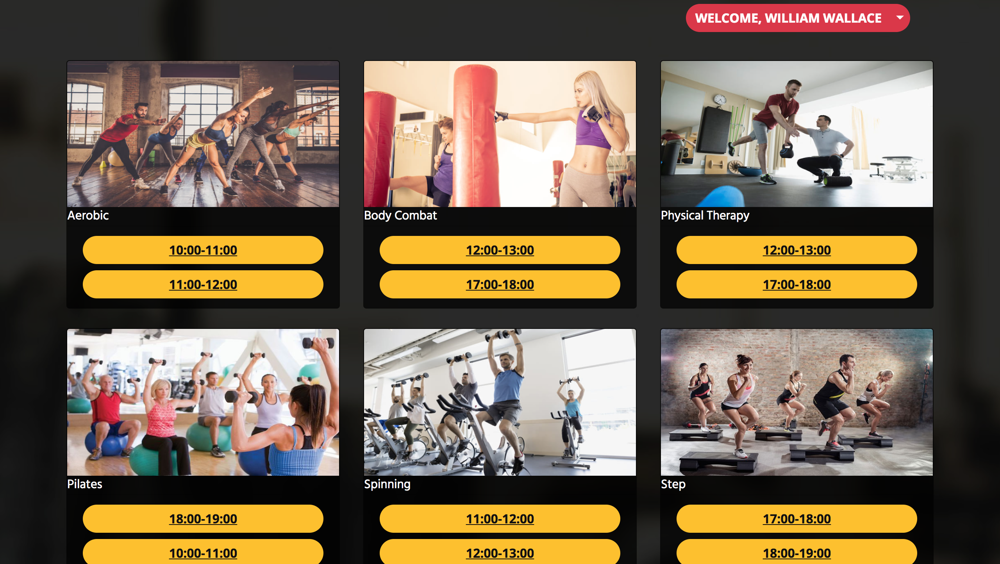
   * Description: This section offers the possibility to sign up the user in any of the courses that are available
 
* __Profile Settings.html:__
    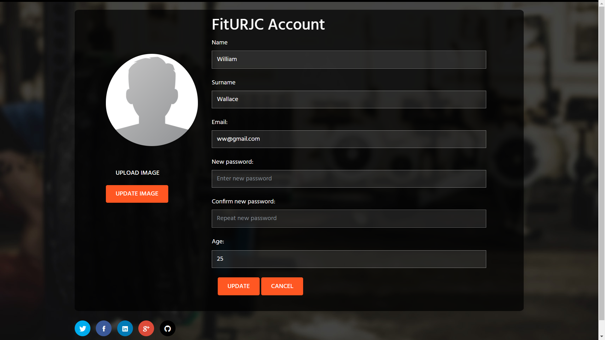
    * Description: If you are identified like a member, you have the possibility to change your profile pic, password or even set your birthdate.
	
* __Admin.html:__
    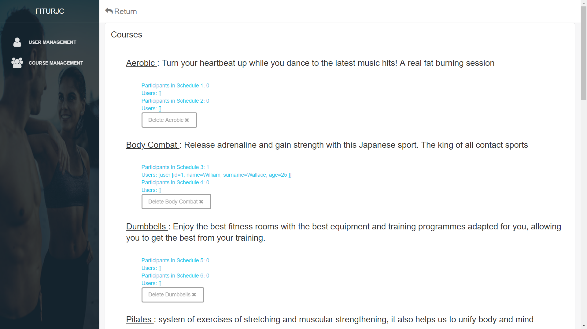
    
    
    * Description: The page of an User that has Admin role. He can manage Users (Delete users, Edit users) and Courses (Delete courses, add courses) In a future this page will have a Graphic part where you will see stadistics about the user preferences.
	
* __Class Diagram:__

    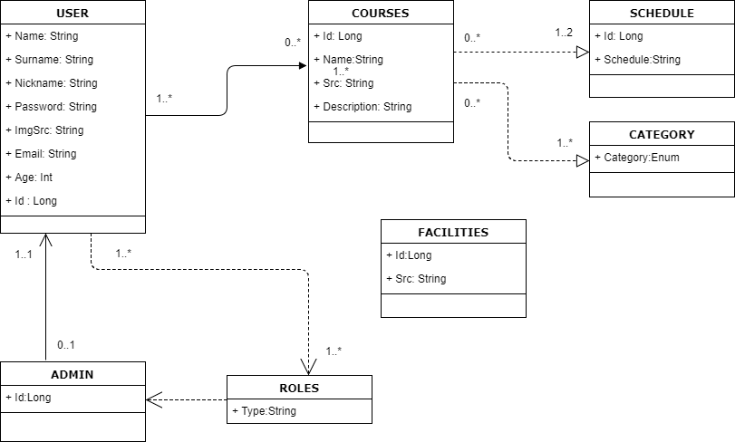
	
* __Template Diagram:__

    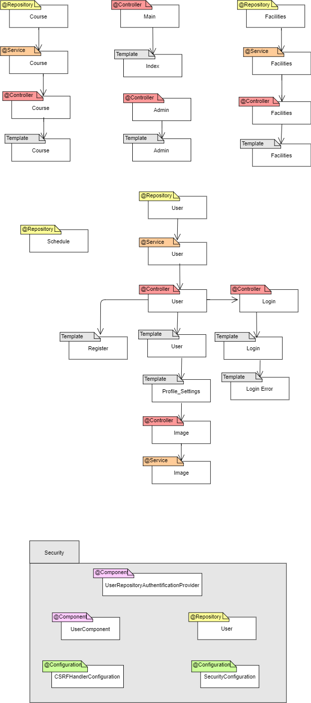
	
* __Data Base Model:__

    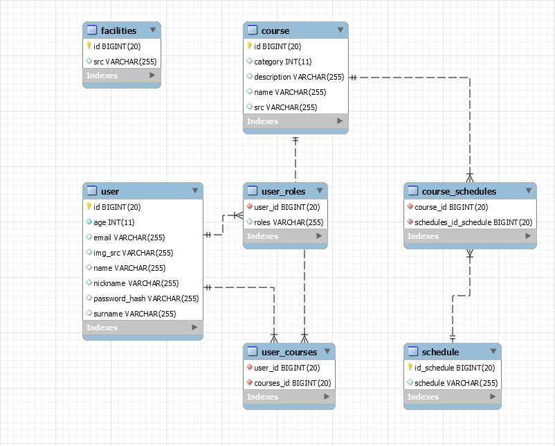
    
* __Configuration Instructions:__
  * Description: Spring Framework provides several data access methods, we use data access via JPA to a MySQL database using    Hibernate.
First we create the project, modifying the pom.xml file so that it contains the dependencies and configurations for JPA and MySQL.

    To indicate to Spring how to access the Database, we need to create the configuration file: application.properties located in src / main / resources.

    We have to create a JPA entity, making a relationship with a relational database. Using the CrudRepository interface we can delete, create, edit or search elements in our data set.
    We add the main class in the MySQL database.

 
* __[Trello's Board](https://trello.com/b/2hRp8ruG/fiturjcdaw)__

* __[Relative reference to API documentation file](https://github.com/IvanPerez9/FitURJC/blob/master/src/main/resources/api.md)__

* __[Relative reference to Angular Diagrams Folder](https://github.com/IvanPerez9/FitURJC/tree/master/angular/diagrams)__
